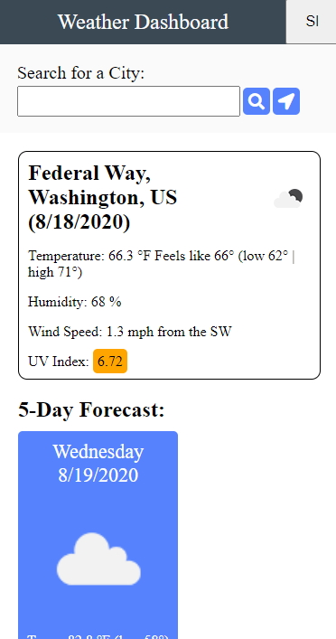
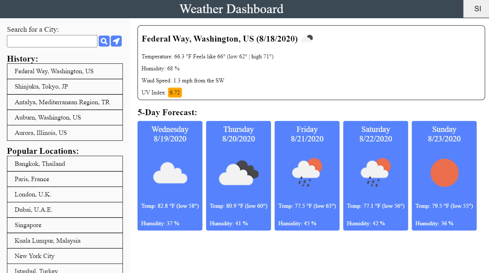
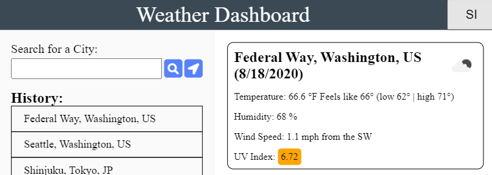
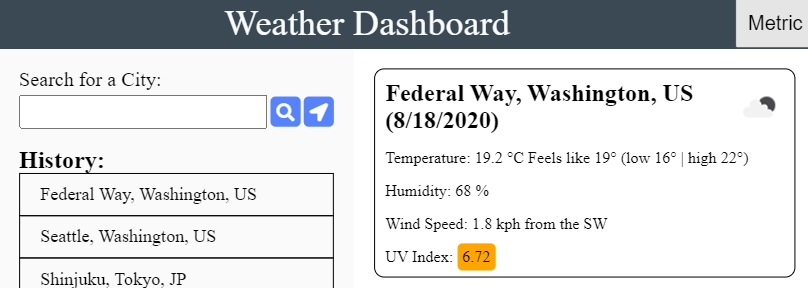

# Weather Dashboard

## Description
Mobile first weather website utilizing API calls to openweathermap.org to present weather information to the user

## Features
### Mobile friendly interface

### Desktop interface

* Includes a recent history list
* Includes 10 popular cities in the world

### User locations
* The website utilizes an api call to getiplookup.io to get an approximate user location (if not using a VPN) based on an IP address to use as the initial website load
* GPS button will allow a more refined location based on the users gps coordinates (if available and if permission is granted)

### Location searching
* City name: Entering just the city name will return the first result from the search engine (most populous city with that name)
* City name, Country: Returns a more accurate version of the city name search
* City name, State, Country: Returns a more accurate version of the city name search
* Latitude, Longitude: Only decimal values (+ or -) are allowed, cardinal directions are not
* Zip code: Search by postal zip code

### Unit switching
* Default units are in SI (degrees fahrenheit and mph)
* Clicking on the SI/Metric button will change units displayed on the screen
    - Does not update the screen if a specific city was not chosen (zipcode or lat/long was used)
* Unit preference is saved to local storage and persists through additional loading of the website

### History and popular cities
* Allows the user to quickly choose a location with a single click
* History is limited to the previous 5 results
* History is not save for location searches (zipcode, lat/long where they do not choose a specific city)